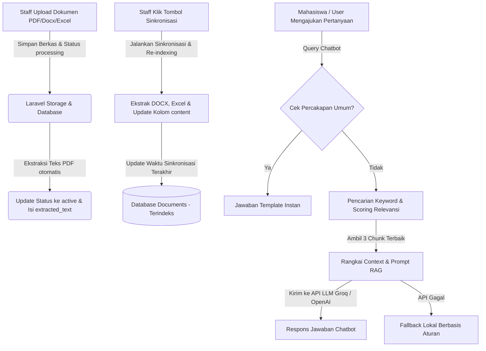

# Dokumentasi Alur Pengelolaan Dokumen dan Pembaruan Informasi Chatbot SIMAK

Dokumentasi ini menjelaskan secara mendalam aspek teknis dan operasional terkait bagaimana staff mengelola dokumen informasi Magang dan Kerja Praktik (KP), bagaimana sistem mengekstrak dan menyinkronkan data tersebut, hingga bagaimana informasi tersebut digunakan oleh mesin pencarian berbasis **RAG (Retrieval-Augmented Generation)** pada chatbot SIMAK.

---

## 1. Arsitektur Umum & Alur Data

Proses dari dokumen fisik hingga menjadi jawaban chatbot melewati 4 tahapan utama:



---

## 2. Struktur Model & Skema Basis Data

Model `App\Models\Document` mewakili dokumen yang diunggah oleh staff.

### Model: `App\Models\Document`
Lokasi berkas: [Document.php](file:///c:/Projects/SIMAK-CHATBOT/app/Models/Document.php)

Berikut adalah kolom-kolom penting dalam tabel `documents`:
*   `title` (string): Judul dokumen yang akan digunakan sebagai referensi pencarian.
*   `description` (text, nullable): Deskripsi tambahan tentang isi dokumen.
*   `type` (enum): Tipe berkas yang diizinkan (`pdf`, `docx`, `excel`, `link`).
*   `file_path` (string): Path penyimpanan berkas fisik di server (`storage/app/documents/`).
*   `original_filename` (string): Nama asli file saat diunggah.
*   `file_size` (integer): Ukuran file dalam satuan byte.
*   `mime_type` (string): MIME type file (misal: `application/pdf`).
*   `status` (enum): Status dokumen (`processing`, `active`, `inactive`). Hanya dokumen berkode `active` yang digunakan dalam basis pengetahuan chatbot.
*   `uploaded_by` (foreign key): ID staff yang mengunggah dokumen (relasi `uploader` ke tabel `users`).
*   `content` (longText, nullable): Hasil ekstraksi teks akhir bersih yang telah disinkronisasikan dan siap di-chunk oleh mesin RAG.
*   `indexed_at` (datetime, nullable): Waktu terakhir kali dokumen disinkronkan ke basis pengetahuan.
*   `chunk_count` (integer): Estimasi jumlah potongan teks (chunk) dari dokumen ini.

---

## 3. Penjelasan Logika Kode & Komponen

### A. Pengunggahan Dokumen & Ekstraksi Awal
Proses pengunggahan ditangani oleh controller [DocumentController.php](file:///c:/Projects/SIMAK-CHATBOT/app/Http/Controllers/DocumentController.php#L62-L139).

Ketika staff mengunggah dokumen baru:
1.  **Validasi Berkas**: Sistem membatasi ukuran file maksimal 10MB dan memverifikasi MIME type/ekstensi agar sesuai dengan jenis dokumen (`pdf`, `docx`, `excel`).
2.  **Penyimpanan Fisik**: File disimpan di disk `local` (lokasi: `storage/app/documents/`).
3.  **Ekstraksi Teks PDF Otomatis**:
    *   Jika file bertipe **PDF**, sistem langsung mengekstrak teks menggunakan parser `Smalot\PdfParser\Parser`.
    *   Teks yang berhasil diekstrak akan dibersihkan dari spasi/jarak kosong yang berlebih dengan regex `preg_replace('/\s+/', ' ', $text)`.
    *   Teks bersih disimpan pada kolom `extracted_text` dan status diubah ke `active`.
    *   Jika ekstraksi gagal, log error akan dicatat, dokumen tetap berstatus `active` dengan keterangan error agar sistem tidak terhambat.
4.  **Tipe DOCX dan Excel**: Status langsung diubah ke `active` tanpa proses ekstraksi awal (proses ekstraksi penuh dilakukan saat sinkronisasi).
5.  **Aktivitas Pencatatan**: Menggunakan `ActivityLog` untuk mencatat siapa staff yang mengunggah berkas tersebut.
6.  **Pembaruan Timestamp**: Pemicuan method `updateKbTimestamp()` memperbarui tanggal pembaruan basis pengetahuan yang disimpan di tabel `settings` (`kb_last_updated_at`).

```php
// Cuplikan Ekstraksi PDF pada DocumentController.php
if ($type === 'pdf') {
    try {
        $fullPath = Storage::disk('local')->path($path);
        $parser = new Parser();
        $pdf = $parser->parseFile($fullPath);
        $text = $pdf->getText();
        $text = trim(preg_replace('/\s+/', ' ', $text));

        $document->update([
            'extracted_text' => $text,
            'status'         => 'active',
        ]);
    } catch (\Exception $e) {
        $document->update([
            'status' => 'active',
            'extracted_text' => 'Gagal mengekstrak teks: ' . $e->getMessage(),
        ]);
        \Log::error("PDF Extraction failed: " . $e->getMessage());
    }
}
```

---

### B. Sinkronisasi (Re-indexing) Basis Pengetahuan
Proses sinkronisasi dilakukan secara massal melalui method `sync` pada [KnowledgeBaseController.php](file:///c:/Projects/SIMAK-CHATBOT/app/Http/Controllers/KnowledgeBaseController.php#L101-L138).

Ketika staff menekan tombol **"Sinkronisasi Sekarang"** di dashboard Knowledge Base:
1.  Sistem mengambil seluruh dokumen aktif (`status = 'active'`).
2.  Untuk setiap dokumen, sistem memeriksa kolom `extracted_text`. Jika kosong, method `extractDocumentText()` dijalankan secara dinamis.
3.  **Ekstraksi Dinamis** (`extractDocumentText`):
    *   **PDF**: Parsing ulang menggunakan parser PDF.
    *   **DOCX**: Berkas `.docx` sebenarnya adalah struktur berkas ZIP. Sistem membuka ZIP tersebut menggunakan `ZipArchive` PHP, membaca berkas XML `word/document.xml`, lalu menghapus tag HTML/XML untuk menyaring teks mentah.
    *   **Excel (CSV/Spreadsheet)**: Jika bertipe CSV, dibaca baris per baris menggunakan `fgetcsv`. Jika XLSX, sistem membuka ZIP dan membaca `xl/sharedStrings.xml`.
4.  Hasil ekstraksi final disimpan ke dalam kolom **`content`** pada tabel `documents`. Kolom `content` inilah yang menjadi sumber kebenaran (Source of Truth) chatbot saat menjawab pertanyaan.
5.  Kolom `indexed_at` diperbarui ke waktu berjalan dan `chunk_count` dihitung ulang.
6.  Status `kb_last_updated_at` diubah ke format tanggal Indonesia (misal: "21 Juni 2026").

```php
// Cuplikan Ekstraksi Dinamis DOCX pada KnowledgeBaseController.php
if ($type === 'docx') {
    $zip = new \ZipArchive();
    if ($zip->open($absolutePath) === true) {
        $xml = $zip->getFromName('word/document.xml');
        $zip->close();
        if ($xml) {
            $text = strip_tags($xml);
            $text = mb_convert_encoding($text, 'UTF-8', 'UTF-8, ISO-8859-1, Windows-1252');
            return trim((string) preg_replace(self::NORMALIZE_WHITESPACE_PATTERN, ' ', $text));
        }
    }
}
```

---

### C. Alur Pencarian RAG (Retrieval-Augmented Generation)
Ketika pengguna mengirimkan pertanyaan ke `/chatbot/query` (ditangani oleh `KnowledgeBaseController@query`):

1.  **Cek Percakapan Umum (`isGeneralConversation`)**:
    Sistem memeriksa apakah pertanyaan adalah sapaan umum seperti *"halo"*, *"terima kasih"*, atau identitas chatbot *"kamu siapa"*. Jika cocok, sistem langsung mengembalikan jawaban statis dari aplikasi untuk menghemat kuota token LLM.
2.  **Klasifikasi dan Pencarian Dokumen Relevan**:
    *   Sistem memotong dokumen-dokumen aktif menjadi bagian kecil (**chunking**) secara virtual menggunakan parameter `chunk_size` (ukuran potongan, default: 750 karakter) dan `chunk_overlap` (irisan antarpotongan untuk menjaga konteks, default: 150 karakter).
    *   Melakukan penilaian kecocokan (scoring) antara query pengguna dengan teks dokumen menggunakan metode pembobotan token kata kunci (`calculateChunkRelevanceScore`). Terdapat penyesuaian khusus untuk singkatan populer seperti `KP` diganti menjadi `Kerja Praktik`.
    *   Mengambil maksimum **3 chunk terbaik** dengan skor tertinggi.
3.  **Penggabungan Konteks & Pengiriman LLM**:
    *   Menggabungkan 3 potongan dokumen menjadi satu string konteks tunggal.
    *   Membaca parameter RAG dari tabel pengaturan seperti: **System Prompt**, **Model** (`groq-llama3-8b` atau `openai-gpt-4o-mini`), dan **Temperature**.
    *   Mengirim data prompt terstruktur ke API Groq atau OpenAI.
4.  **Fallback Mekanisme**:
    Jika koneksi API LLM eksternal terputus atau gagal, sistem akan secara otomatis beralih ke logika `generateFallbackAnswer()` secara lokal. Jawaban lokal ini memanfaatkan pencocokan regex cerdas berdasarkan tipe pertanyaan (waktu, syarat, prosedur) dan mengambil potongan data dari dokumen yang dinilai paling relevan secara lokal.
5.  **Pencatatan Chat Log**:
    Pertanyaan asli, hasil normalisasi kata kunci, dan jawaban yang dihasilkan disimpan dalam tabel `chat_logs` untuk kebutuhan statistik performa chatbot.

---

## 4. Panduan Operasional Staff (Pembaruan Informasi)

Untuk memperbarui informasi yang dikuasai chatbot, staff harus melakukan langkah-langkah berikut melalui Dashboard Admin:

1.  **Masuk ke Menu "Kelola Dokumen"**:
    *   Buka menu manajemen dokumen pada dashboard admin.
2.  **Unggah Dokumen Baru atau Perbarui yang Lama**:
    *   Jika informasi baru berbentuk PDF, Word, atau Excel, klik tombol **"Upload Dokumen"**.
    *   Masukkan **Judul** yang deskriptif (sangat penting karena judul berkontribusi besar pada skor pencarian relevansi chatbot).
    *   Pilih berkas dan tentukan tipe berkasnya. Klik **Simpan**.
3.  **Nonaktifkan Informasi Lama (Jika Diperlukan)**:
    *   Jika ada dokumen panduan lama yang informasinya sudah tidak berlaku, edit dokumen tersebut dan ubah statusnya menjadi **Inactive**, atau lakukan **Hapus** (Soft Delete) agar berkas tersebut tidak lagi dibaca oleh chatbot.
4.  **Masuk ke Menu "Knowledge Base" & Lakukan Sinkronisasi**:
    *   Buka halaman **Knowledge Base** pada dashboard admin.
    *   Periksa status daftar dokumen di bawah untuk memastikan berkas yang baru saja diunggah telah masuk dan berstatus *Active*.
    *   Klik tombol **"Sinkronisasi Sekarang"** di bagian atas halaman.
    *   Tunggu hingga notifikasi sukses muncul. Proses ini akan membaca berkas, mengekstrak teks, dan menyimpannya ke memori indeks chatbot.
5.  **Uji Coba Chatbot (Playground)**:
    *   Pada halaman yang sama, terdapat panel **Playground Chatbot** di sebelah kanan.
    *   Staff dapat mengetikkan pertanyaan uji coba terkait informasi yang baru diunggah untuk memverifikasi apakah LLM telah mengenali informasi tersebut dan merespons dengan benar sesuai dengan dokumen rujukan.
